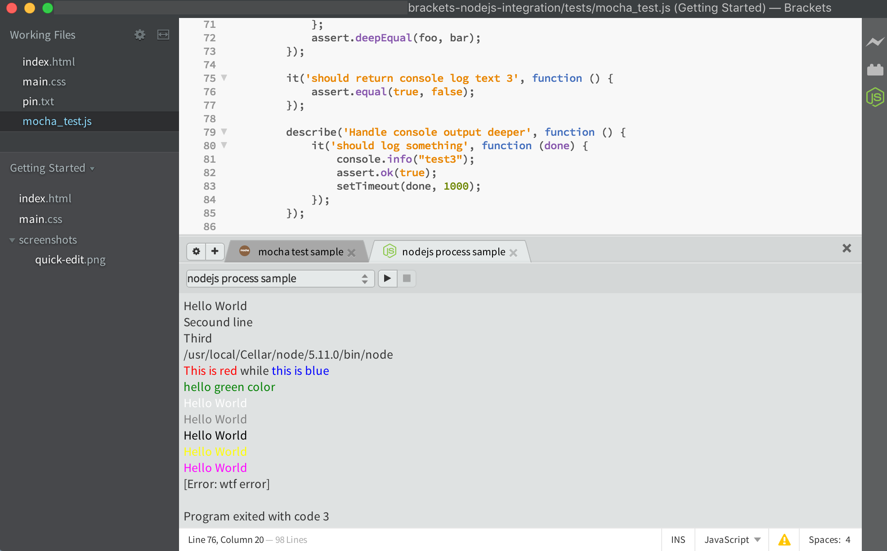
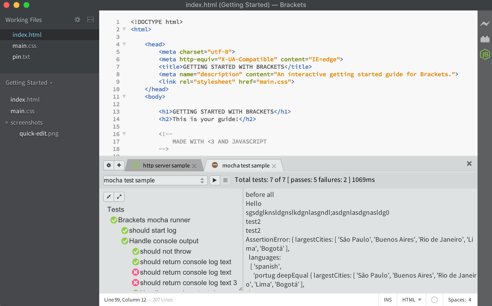
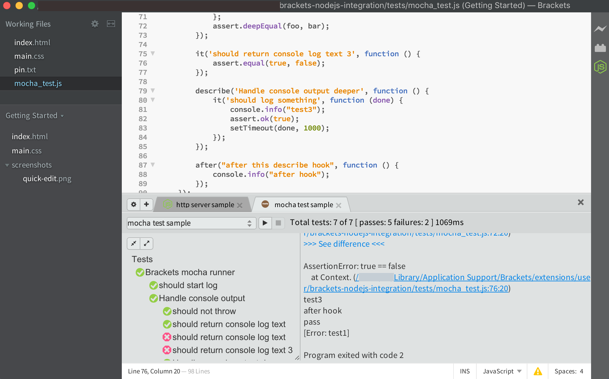
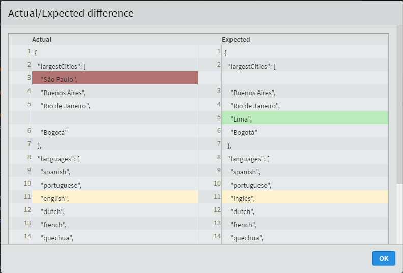
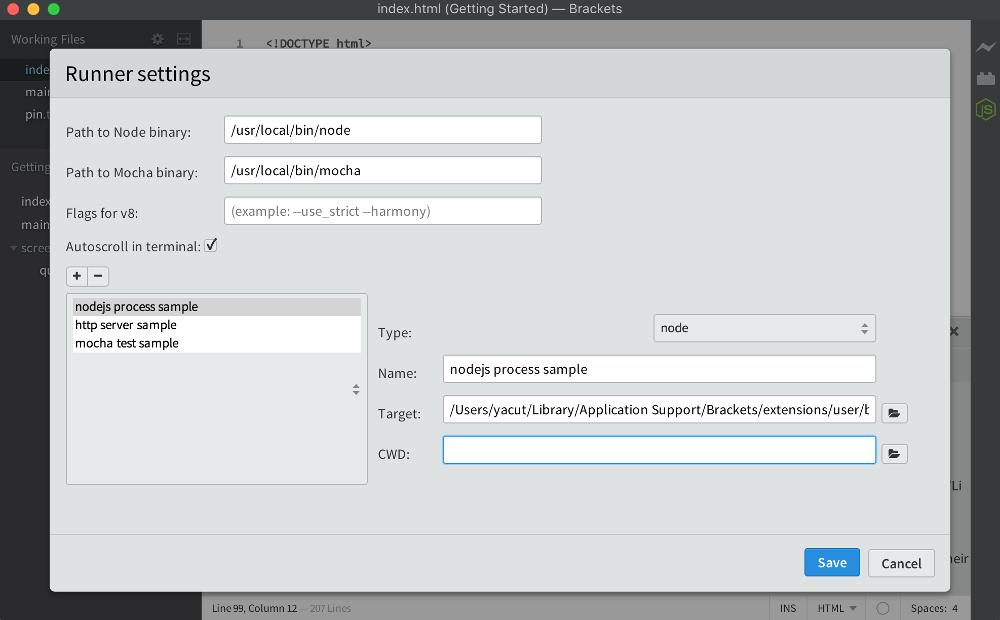

# Brackets - NodeJS integration

Brackets - NodeJS integration is an extension for [Brackets](http://brackets.io/) editor - it provides Nodejs and Mocha integration for Brackets.
It's tested and works on any platform supported by Brackets (Windows, Mac OS X, GNU/Linux).

## Installation

#### Dependencies:
To make **Brackets - NodeJS integration** work you'll need nodejs, npm and mocha installed in your system:

- **Windows**: [Nodejs and NPM for Windows](https://nodejs.org/en/download/)
- **Mac OS X**: [Nodejs and NPM for Mac](https://nodejs.org/en/download/package-manager/#osx)
- **GNU/Linux**: [Nodejs and NPM for Debian/Ubuntu](https://nodejs.org/en/download/package-manager/#debian-and-ubuntu-based-linux-distributions)
- **Mocha for all systems**:
   ```
   npm install mocha -g
   ```

#### Extension installation:
To install latest release of **Brackets - NodeJS integration** use the built-in Brackets Extension Manager which downloads the extension from the [extension registry](https://brackets-registry.aboutweb.com/).

#### Configuration:
Extension can be configured by opening the `NodeJS integration` Panel and clicking the *Open settings* button.

## Features and limitations

Currently **Brackets - NodeJS integration** supports these features (this list may be incomplete as we add new features regularly):

- Run multiple nodejs processes inside editor with console output
- Run mocha test inside editor with tree view results
- Open file via mouse click from error stack
- Show Actual/Expected difference for mocha test

## Some screenshots:

  
*Main panel of NodeJS integration - run nodejs process*

  
*Main panel of NodeJS integration - run mocha test*

  
*Main panel of NodeJS integration - quick open error file*

  
*Mocha test result - Show asert difference*

  
*Settings dialog*
